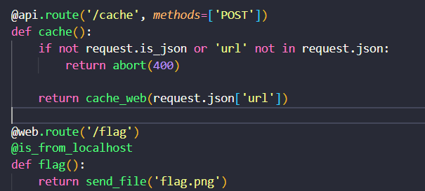
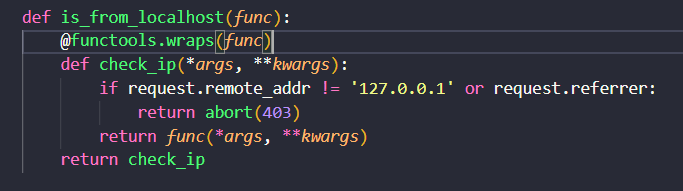
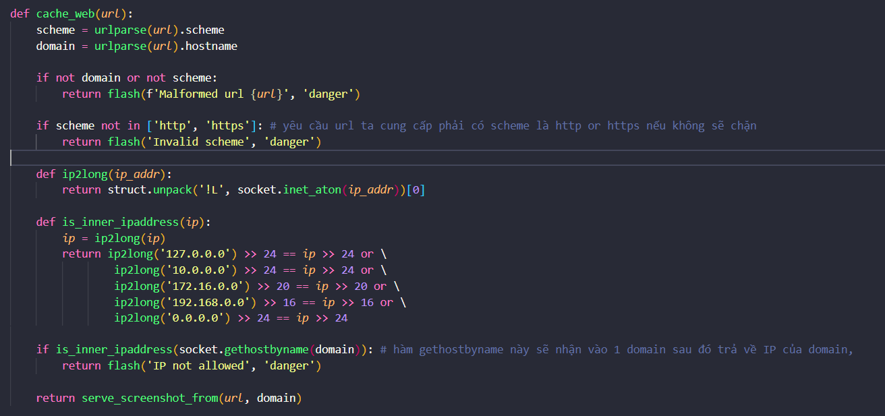
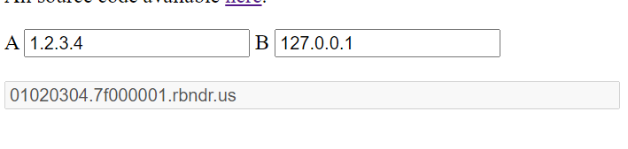
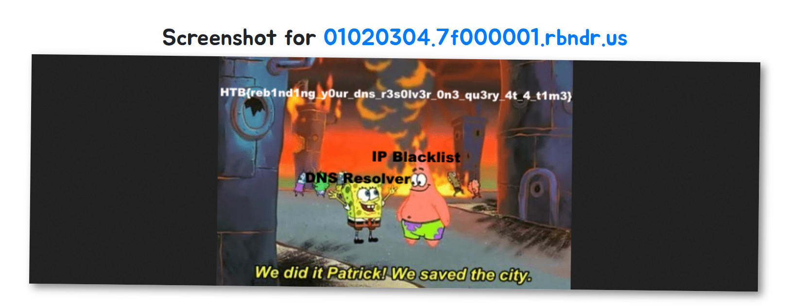
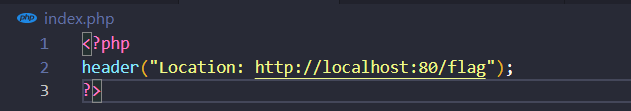

# PHÂN TÍCH

Bài này có 2 route chính như sau:

Để có flag thì ta sẽ phải gửi đến `/flag` nhưng req phải từ local thì nó mới cho :))

Hàm check xem là request có đến từ local hay ko

Ta sẽ coi một hàm quan trọng và cũng chính là mấu chốt bài này.

Ta thấy ở đây nó đang sài hàm `gethostbyname` để lấy địa chỉ ip từ domain mà ta cung cấp, nếu ip nằm trong blacklist sẽ bị ban , còn không nó sẽ gọi đến hàm

 `serve_screenshot_from` và thực thi get request để trả về ảnh chụp của url đó.

 

# KHAI THÁC

BÀI NÀY CÓ 2 CÁCH ĐỂ CÓ ĐƯỢC FLAG
 

## SOLUTION 1: SÀI DNS REBINDING

Sau đó nó thực hiện get request đến cái url đó, và một lần nữa thực thi một câu dns query đến domain đó. Lợi dụng việc này mình sử dụng kĩ thuật DNS REBINDING

để trỏ 2 IP vào cùng một domain, và TTL cực ngắn. Và mỗi lần thực hiện một câu dns query, nó sẽ trả về 1 cách random 1 trong 2 giá trị ip đó.

Cụ thể ở bài này mình sài như sau:  

link website: https://lock.cmpxchg8b.com/rebinder.html

và bây giờ thì lấy domain đó đi submit và thêm path /flag vào
Và đến lúc chơi trò chơi nhân phẩm rồi. 
Có 3 trường hợp sẽ xảy ra như sau:
+ TH1: Lần đầu nó trả về `127.0.0.1` thì xong, bị ban ngay lần check ip và chưa thực thi get request
+ TH2: Lần đầu nó trả về `1.2.3.4` (bypass được blacklist), sau đó get request trả về ip là `1.2.3.4` thì sẽ dính time out vì méo có địa chỉ nào như vậy =)))
+ TH3: Trường hợp mà ta cần , lần đầu trả về `1.2.3.4`, sau đó get request trả về ip là `127.0.0.1` => có được flag

 

Tuỳ vào độ nhân phẩm của bạn sẽ cần số req khác nhau kk

 

 

## SOLUTION 2: SỬ DỤNG REDIRECT ĐỂ BYPASS IP BLACKLIST

Ở cách này thì dễ hơn, mình sẽ host một file index.php trên server của mình. Nội dung file sẽ redirect đến localhost của webserver. Vì là server của mình nên nó sẽ bypass được việc check ip.

 

Và ta cũng sẽ có flag như SOLUTION1

 

Flag: HTB{reb1nd1ng_y0ur_dns_r3s0lv3r_0n3_qu3ry_4t_4_t1m3}